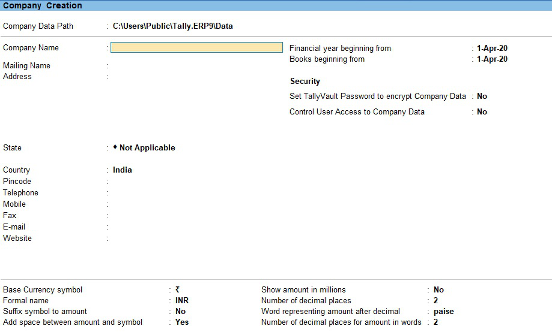
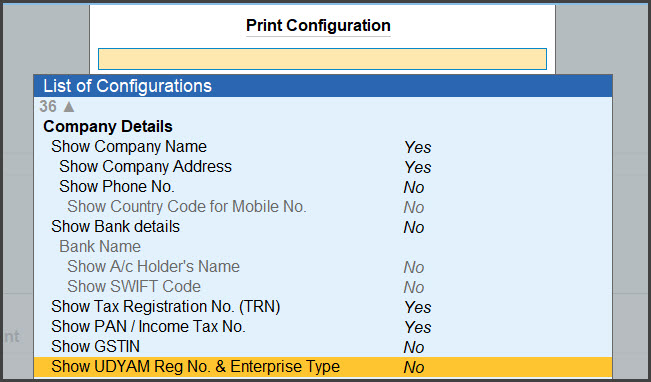

# Fundamentals: Company Creation

This chapter explains the basic steps for creating and maintaining a company in **Tally Prime**, including company details, statutory information (GST, TDS, TCS), and account management.

---

## Creating a Company

### Steps

1. Open **Tally Prime**.  
2. From the **Gateway of Tally**, select **Create Company**.  
3. Enter the following details carefully:

| Field | Description |
|--------|-------------|
| **Directory** | Folder path where company data will be stored. |
| **Name** | Legal name of the company (e.g., *ABC Traders Pvt. Ltd.*). |
| **Mailing Name** | Can be same as the company name or a trade name. |
| **Address** | Full postal address. |
| **Country** and **State** | Choose correct location for GST and statutory compliance. |
| **Pincode** | Optional but recommended. |
| **Telephone / Mobile / Email / Website** | Contact details for invoices and reports. |

### Example

**Name:** RK Enterprises  
**Mailing Name:** RK Enterprises  
**Address:** No. 12, Main Road, Chennai – 600001  
**Country:** India  
**State:** Tamil Nadu  
**Email:** info@rkenterprises.in  

---

## Visual Reference – Company Creation Screens

{width=70%}
{width=70%}
{width=70%}
{width=70%}
{width=70%}
{width=70%}
>*Figure: Company Creation screen in TallyPrime – entering name, address, mailing name, books-beginning date, currency symbol.*  

