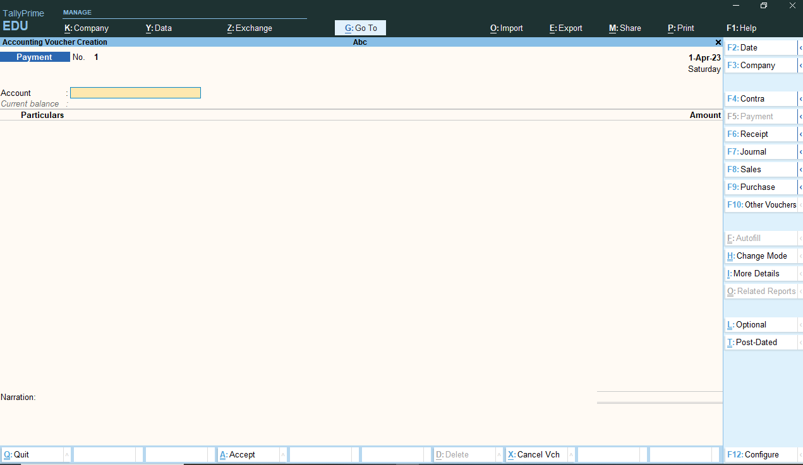

# Accounting Vouchers — Types 

This chapter explains the major **voucher types** used in Tally Prime and gives clear, step-by-step instructions to create each voucher. Every voucher section contains:

---

- Purpose of the voucher  
- When to use it  
- Step-by-step procedure in Tally Prime (with keystrokes)  
- A worked example (debit / credit entries)  
- Short troubleshooting and tips

> **Quick note:** Before entering vouchers, ensure you have:
>
> 1. Selected the correct company.  
> 2. Set the correct financial year & date.  
> 3. Created required ledgers (Cash, Bank, Debtors, Creditors, Sales, Purchase, Tax ledgers, Expense ledgers, etc.).  
> 4. Enabled relevant features (F11 → Accounting Features / F3 → Statutory & Taxation) if taxes are involved.

---

## Shortcuts used in steps

- **Alt + F1** — Select / Shut company  
- **Alt + F3** — Company Info / Backup (also used to create company)  
- **V** (from Gateway of Tally) or **Accounting Vouchers** menu → open vouchers list  
- **F8** — Payment Voucher (default)  
- **F5** — Payment or Receipt (depends on version) — check your Tally mapping  
- **F6** — Receipt Voucher  
- **F7** — Journal Voucher  
- **F4** — Contra Voucher  
- **F9** — Purchase Voucher  
- **F8** / **F10** / **F11** — Sales / Rejections / Multi-Functions (versions vary)  
- **Ctrl + A** — Accept screen / Save voucher  
- **Ctrl + R** — Repeat narration (where available)  
- **Alt + R** — Toggle round-off (version dependent)

> Shortcut keys may vary slightly between Tally Prime releases — always check the voucher menu keys displayed at the top of the voucher screen.

---

## Contra Voucher (Transfer between Cash/Bank)

**Purpose:** Transfer of funds between Cash and Bank (e.g., cash deposited to bank, bank cash withdrawal).

**When to use:** Cash → Bank deposit, Bank → Cash withdrawal, Bank → Bank (transfer between bank accounts).

### Steps (Contra)
1. Gateway of Tally → **Accounting Vouchers** → Press **F4** (Contra).  
2. Enter **Date** (top-left).  
3. **Dr / Cr line 1**: Select ledger **Bank of India - Current** (or target bank), enter amount (this will be **Dr** if receiving in bank).  
4. **Cr line 2**: Select ledger **Cash-in-Hand**, enter same amount (this will be **Cr**).  
   - Alternatively, reverse order depending on how your version shows Dr/Cr. Tally shows the first ledger as Dr by default.  
5. Add **Narration** (brief note: "Cash deposit to bank - branch X").  
6. Press **Ctrl + A** to accept and save.

### Example
- Deposit ₹20,000 cash to bank:
  - Debit: Bank of India - Current ₹20,000  
  - Credit: Cash-in-Hand ₹20,000

> 💡 **Tip:** Use **Contra** when both sides are bank/cash — taxes are not applicable.

---

## Payment Voucher

**Purpose:** Payment made to suppliers, expenses, utilities, wages.

**When to use:** Paying cash or bank transfers to creditors or expense payments.

### Steps (Payment)
1. Gateway of Tally → **Accounting Vouchers** → Press **F5** / **F8** (Payment — check your version).  
2. Enter **Date**.  
3. In the **Pay From** ledger (usually top line), select **Bank of India - Current** or **Cash-in-Hand** depending on payment mode.  
4. In the **Particulars** (opposite) select the ledger being paid (e.g., **ABC Suppliers** or **Electricity Expense**).  
5. Enter **Amount** and any tax fields (if TDS or TCS applies, enable and fill).  
6. Add **Narration**: "Payment to ABC Suppliers for invoice #45".  
7. Press **Ctrl + A** to save.

### Example
- Paid rent ₹10,000 by bank:
  - Debit: Rent Expense ₹10,000  
  - Credit: Bank of India - Current ₹10,000

> 💡 **Tip:** If paying multiple ledgers in one payment voucher, use additional lines for each ledger (split payments). Use `Payment` for outgoing cash/bank only.

---

## Receipt Voucher

**Purpose:** Receive money — cash sales, receipts from customers, odd receipts.

**When to use:** Cash received from customers, bank deposits from sales, loans received.

### Steps (Receipt)
1. Gateway of Tally → **Accounting Vouchers** → Press **F6** (Receipt).  
2. Enter **Date**.  
3. **Dr** ledger: Choose **Cash-in-Hand** or **Bank of India - Current** (where funds received).  
4. **Cr** ledger: Select **Sundry Debtors** or **Sales** depending on reason.  
5. Enter **Amount**.  
6. Add **Narration**.  
7. Press **Ctrl + A** to save.

### Example
- Customer paid cash ₹5,000:
  - Debit: Cash-in-Hand ₹5,000  
  - Credit: Sundry Debtors (or Sales) ₹5,000

> 💡 **Tip:** For receipt from sales, you may use **Sales Voucher** instead (captures tax/sales specifics). Use receipt for misc receipts or receipts not tied to sales invoice.

---

## Journal Voucher

**Purpose:** Record non-cash adjustments, accruals, depreciation, rectification entries, provisions, closing entries.

**When to use:** Opening adjustments, accruals, transfer between ledgers where no cash/bank changes happen.

### Steps (Journal)
1. Gateway of Tally → **Accounting Vouchers** → Press **F7** (Journal).  
2. Enter **Date**.  
3. Enter **Dr** ledger (e.g., `Depreciation Expense`) with amount.  
4. Enter **Cr** ledger (e.g., `Accumulated Depreciation`) with same amount.  
5. Provide **Narration** and press **Ctrl + A**.

### Example
- Depreciation ₹2,000:
  - Debit: Depreciation Expense ₹2,000  
  - Credit: Accumulated Depreciation ₹2,000

> 💡 **Tip:** Journal vouchers are the standard for adjusting accounts that don’t affect cash/bank. Use distinct narration and voucher numbering for audit clarity.

---

## Sales Voucher (Invoice / Sales Entry)

**Purpose:** Record sale of goods or services (with or without tax).

**When to use:** Sales to customers, credit or cash sales, applies GST/Taxes as per settings.

### Steps (Sales)
1. Gateway of Tally → **Accounting Vouchers** → Choose **Sales Voucher** (F8 / F10 depending on setup).  
2. Enable **Use Invoice Mode** (if you want item-level invoices) — press **F12** / check voucher configuration — choose **Invoice mode**.  
3. Enter **Date**.  
4. **Party A/c name**: Select customer (Sundry Debtors).  
5. **Sales ledger**: Select `Sales Account` (or product-specific sales ledger).  
6. **Inventory items**: If in invoice mode, choose item(s), quantity, rate — Tally calculates amount.  
7. **GST / Tax**: If GST enabled, Tally will show GST breakup; select tax ledgers for CGST/SGST/IGST as required.  
8. Check **Total**, add **Narration** (invoice reference).  
9. Press **Ctrl + A** to accept.

### Example (Taxable sale)
- Sale of goods to Ram Traders ₹30,000 (GST 18%):
  - Debit: Sundry Debtors — Ram Traders ₹35,400  
  - Credit: Sales ₹30,000  
  - Credit: CGST ₹2,700  
  - Credit: SGST ₹2,700

*(Tally will auto-break tax if tax ledgers configured.)*

> 💡 **Tip:** Use **Invoice Mode** for GST compliance (invoice numbering, item details). Check customer shipping details & GSTIN before saving.

---

## Purchase Voucher

**Purpose:** Record purchases from suppliers (credit or cash purchases), with taxes.

**When to use:** Purchase of goods or services from vendors.

### Steps (Purchase)
1. Gateway of Tally → **Accounting Vouchers** → Press **F9** (Purchase).  
2. Enter **Date**.  
3. **Party A/c name**: Select supplier (Sundry Creditors).  
4. **Purchase ledger**: Choose purchases ledger (or item-specific).  
5. Enter **items**, quantity, rate (invoice mode recommended).  
6. **GST / Tax**: Ensure GST is properly applied (Tally splits tax amounts).  
7. Add **Narration** and **Bill-wise details** if using credit (for payment terms).  
8. Press **Ctrl + A**.

### Example
- Bought raw materials worth ₹40,000 (GST 18%):
  - Debit: Purchases ₹40,000  
  - Debit: CGST ₹3,600  
  - Debit: SGST ₹3,600  
  - Credit: Sundry Creditors — ABC Suppliers ₹47,200

> 💡 **Tip:** When entering purchases on credit, use **Bill-wise details** to track due dates and apply payments properly.

---

## Credit Note (Sales Return / Credit Memo)

**Purpose:** To record returns or credit given to customers against earlier sales.

**When to use:** Customer returns goods, adjustment of invoices, price corrections.

### Steps (Credit Note)
1. Gateway of Tally → **Accounting Vouchers** → Choose **Credit Note** (under Sales Vouchers or special voucher).  
2. Enter **Date** and **Party** (customer).  
3. Select **Sales Return** ledger or use negative quantity in invoice mode.  
4. Enter returned items / amounts.  
5. Tally will adjust tax ledgers accordingly.  
6. Press **Ctrl + A** to save.

### Example
- Customer returns goods of ₹5,000 (GST applicable):
  - Debit: Sales Return / Sales (reverse entry) ₹5,000  
  - Debit: CGST (reverse) ₹450  
  - Debit: SGST (reverse) ₹450  
  - Credit: Sundry Debtors ₹5,900

> 💡 **Tip:** Use Credit Notes with reference to original invoice for audit trail.

---

## Debit Note (Purchase Return / Debit Memo)

**Purpose:** To record return of goods to suppliers or debits from supplier for price corrections.

**When to use:** You return items to supplier or supplier issues a debit note.

### Steps (Debit Note)
1. Gateway of Tally → **Accounting Vouchers** → Choose **Debit Note** (under Purchase Vouchers).  
2. Enter **Date** and **Party** (supplier).  
3. Enter returned items and quantity (invoice mode advisable).  
4. Tally adjusts tax ledgers (reverse purchase entries).  
5. Press **Ctrl + A** to save.

### Example
- Return goods worth ₹8,000 to supplier:
  - Debit: Sundry Creditors ₹9,440  
  - Credit: Purchase Return ₹8,000  
  - Credit: CGST ₹720  
  - Credit: SGST ₹720

---

## Additional Practical Notes

### Bill-wise details for credit transactions
When making sales/purchase on credit, use **Bill-wise details** to:
- Record invoice numbers
- Record due dates
- Track aging and collections

Path: In voucher screen, press **F2** / check the bill-wise field and enter invoice number and due date.

### Voucher numbering & series
- Configure voucher numbering in **F11 → Accounting Features** or voucher configuration to auto-number invoices and vouchers.
- For compliance, ensure Sales/Purchase invoices are sequential.

### Using Narration and References
- Always add a meaningful **narration** (invoice #, PO #) for audit trail.
- Use **Reference** fields for external docs.

### Reverse / Adjust Transactions
- To reverse a voucher, use a journal entry reversing the original entries with clear narration.
- Avoid altering historic voucher numbers — create adjustment voucher with reference.

---

## Illustration

1. Company starts business — Capital introduced ₹1,00,000 (Journal)
   - Dr Cash-in-Hand ₹1,00,000  
   - Cr Capital Account ₹1,00,000

2. Deposit ₹50,000 into bank (Contra)
   - Dr Bank ₹50,000  
   - Cr Cash ₹50,000

3. Purchase goods on credit from ABC Suppliers ₹30,000 (Purchase)
   - Dr Purchases ₹30,000  
   - Cr Sundry Creditors — ABC Suppliers ₹30,000

4. Make a payment to ABC Suppliers ₹15,000 (Payment)
   - Dr Sundry Creditors — ABC Suppliers ₹15,000  
   - Cr Bank ₹15,000

5. Make sales to Ram Traders on credit ₹20,000 (Sales)
   - Dr Sundry Debtors — Ram Traders ₹20,000  
   - Cr Sales ₹20,000

6. Ram Traders pays ₹20,000 by cash (Receipt)
   - Dr Cash ₹20,000  
   - Cr Sundry Debtors — Ram Traders ₹20,000

---

## Troubleshooting & Common Issues

- **Voucher type missing**: Check **F11 → Features** and voucher configuration; some vouchers are hidden by default.  
- **Tax not calculated**: Ensure GST is enabled and tax ledgers are created and attached to item ledger.  
- **Cannot delete voucher**: User permissions or voucher linked to reports — use Reverse/Adjustment instead.  
- **Incorrect ledger chosen**: Undo (Ctrl+Z not always available) — use Voucher Alter to correct or create reversal voucher.

---

## Example Payment Voucher Entry Screen

{width=70%}

> Figure: Example Payment Voucher entry screen.

---

## Quick Reference Table — Voucher Types

| Voucher Type | Use | Typical Shortcut |
|---------------|-----|------------------|
| Contra | Cash/Bank transfers | F4 |
| Payment | Payments to suppliers/expenses | F5 / F8 |
| Receipt | Cash receipts / customer payments | F6 |
| Journal | Adjustments / non-cash entries | F7 |
| Sales | Sales invoices (taxable) | F8 / Sales key |
| Purchase | Purchase invoices | F9 |
| Credit Note | Sales returns / credit to customer | (Sales menu) |
| Debit Note | Purchase returns / debit from supplier | (Purchase menu) |

---
